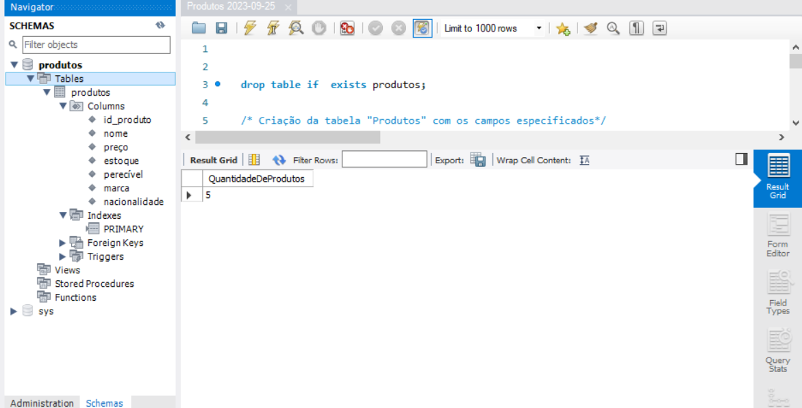
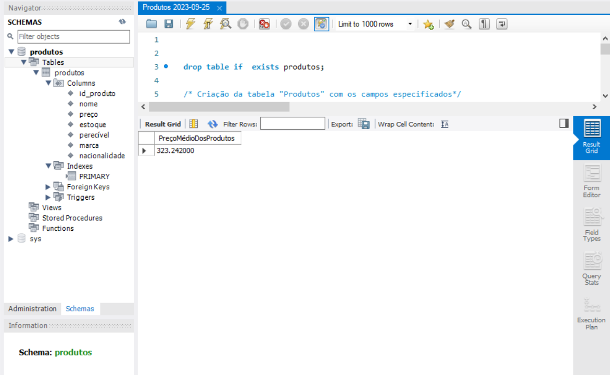
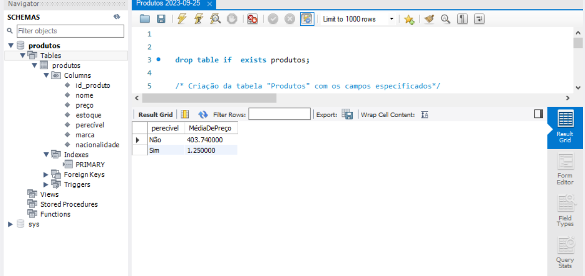
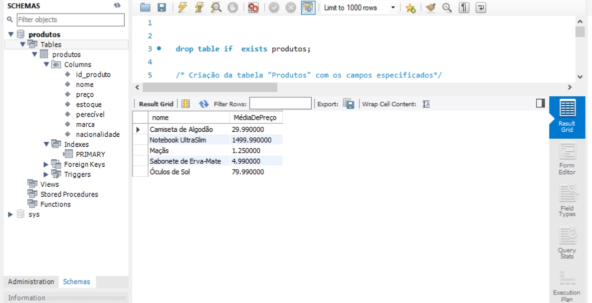
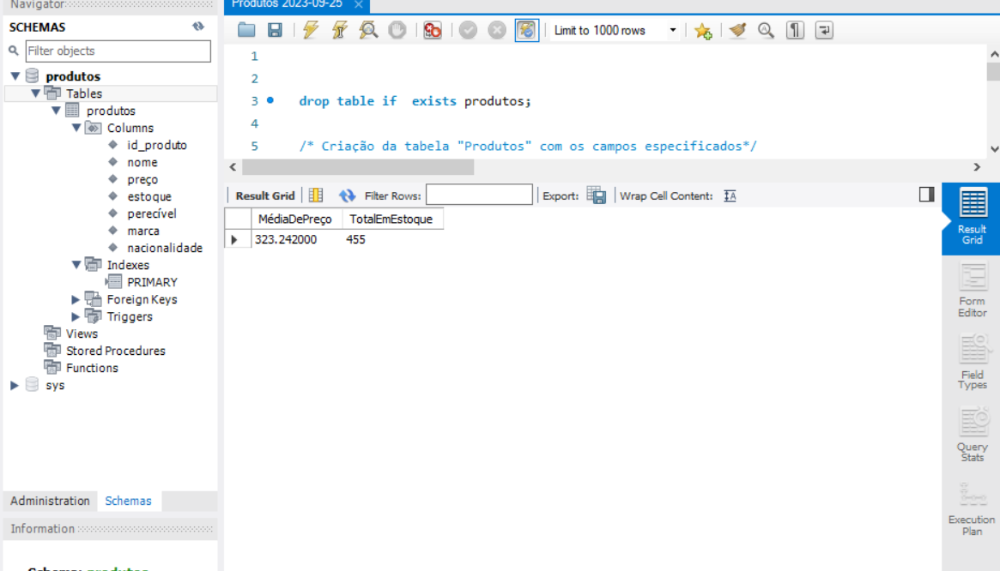
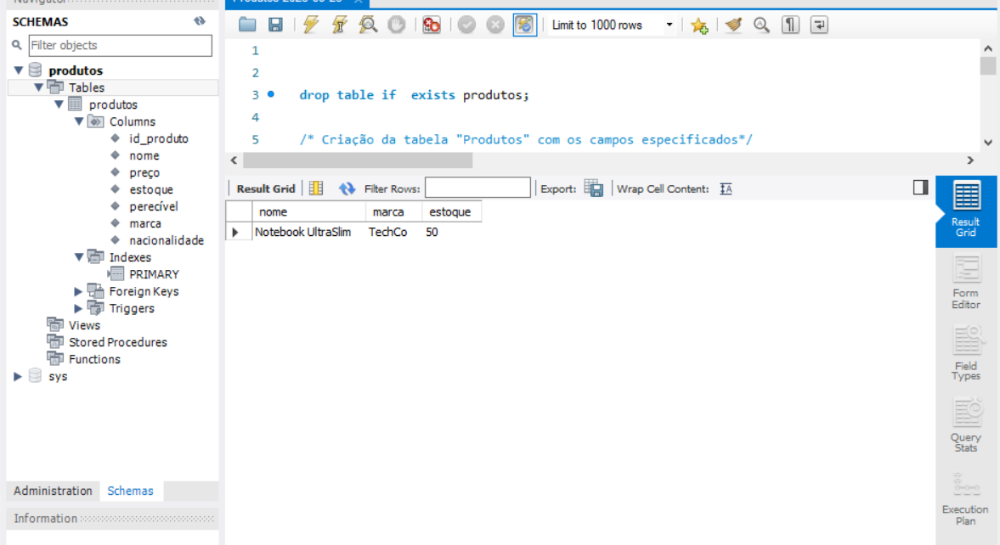
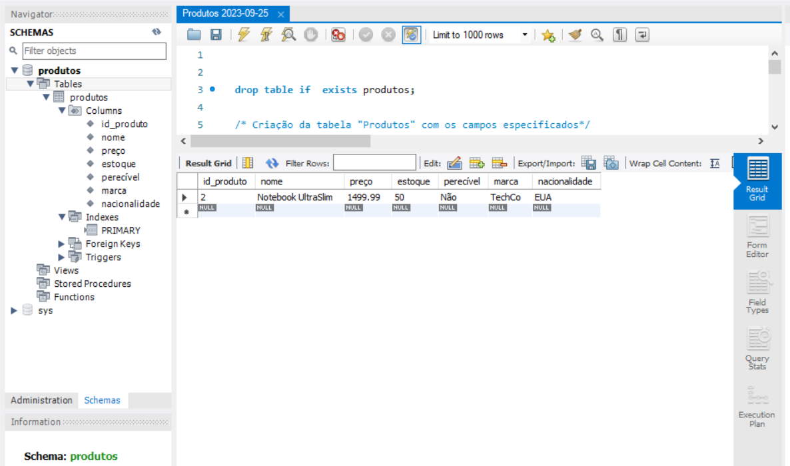

# Exercício de Banco de Dados (Produtos) - AC2
## Gerando um relatório informando quantos produtos estão cadastrados.

Script SQL:
[SQL](Produtos%20(2)%202023-09-25.sql)

## Gerando um relatório informando o preço médio dos produtos.

Script SQL:
[SQL](Produtos%20(3)%202023-09-25.sql)

## Selecionando a média dos preços dos produtos em 2 grupos: perecíveis e não perecíveis.

Script SQL:
[SQL](Produtos%20(4)%202023-09-25.sql)

## Selecionando a média dos preços dos produtos agrupados pelo nome do produto.

Script SQL:
[SQL](Produtos%20(5)%202023-09-25.sql)

## Selecionando a média dos preços e total em estoque dos produtos.

Script SQL:
[SQL](Produtos%20(6)%202023-09-25.sql)

## Selecionando o nome, marca e quantidade em estoque do produto mais caro.

Script SQL:
[SQL](Produtos%20(7)%202023-09-25.sql)

## Selecionando os produtos com preço acima da média.

Script SQL:
[SQL](Produtos%20(8)%202023-09-25.sql)

## Selecione a quantidade de produtos de cada nacionalidade.

Script SQL:
[SQL](Produtos%20(9)%202023-09-25.sql)

## SQL na íntegra.
SQL: 
[SQL](Produtos%202023-09-25.sql)

